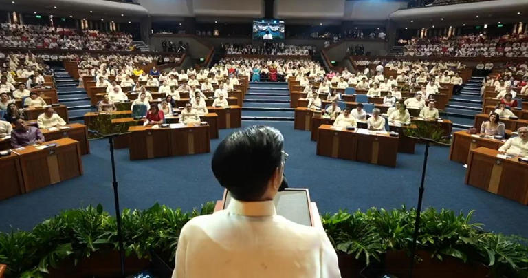

# SONA 2025 In the Eyes of A Young Filipino Student

#### Brief History
The State of the Nation Address is held every year to highlight the accomplishments of the current administration the past year. It started with President Manuel Quezon, who gave the first SONA under the Commonwealth administration on **November 25, 1935.** 

Ever since then, it has become an annual tradition. Its only gaps during the Second World War and 1986, in which the 20-year dictatorship of Former President Ferdinand Marcos was put to an end.

#### "That's Interesting!"

### 
Give 1-3 key points from SONA 2025 that you found weird for any reason (explaining is optional)

#### SONA 2025: Maaari nga ba?
Write 2 paragraphs of reflection (each paragraph is ideally around 4 sentences)

What 1 word/ phrase/ or sentence do you have for the Philippines after hearing SONA 2025?